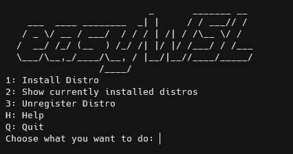

<h1 align="center"> easyWSL</h1>  

  

  Create WSL distros based on Docker Images.

> Made with ❤ by @wrobeljakub and @redcode-labs team.

## easyWSL 2.0

The new version of easyWSL with graphical interface and many new features is almost finished. If you want to test the upcoming release please fill out [this form](https://docs.google.com/forms/d/e/1FAIpQLScPDEdioodHhtJHdnrep4boNk4NAHyvwiQ0XZSKh26omkWfGg/viewform).

## What does this project do?

There's a script inside which downloads a .tar or .tar.gz image from Docker Hub. In fact, it can be more than just one .tar/.tar.gz, that's why bsdtar.exe is included in this repo, because it is responsible for 'merging' all .tar/.tar.gz files together. Then, one big .tar/.tar.gz is created (if it's needed, we don't have to do this thing if the image contains just one layer) and can be easily exported as a WSL distro.

## How to use it?

Just go to our release page, download latest release and just run it. Done!

## Building on your own

### Prerequisites

* Windows 10 1607 or later (for WSL1) or Windows 10 1903 (18362) or later
   * Note: you might want to check instructions on how to enable WSL [here](https://docs.microsoft.com/en-us/windows/wsl/install-manual)
* [Developer Mode enabled](https://docs.microsoft.com/windows/uwp/get-started/enable-your-device-for-development)
* [Visual Studio 2019](https://visualstudio.microsoft.com/downloads/) or later
* The following workloads:
   * .NET Desktop Development
* The following extensions:
   * [System.Text.Json](https://www.nuget.org/packages/System.Text.Json/5.0.2?_src=template)

(Upon opening the repo in Visual Studio, it will prompt you to install any missing workloads and features.)

### Building

We currently only build using the solution; command line methods of building a VS solution should work as well.

## Command List

`--help` / `-h` -> list all available commands
`--name` / `-n` -> name for your distro
`--distro` / `-d` -> id of the distro in the sources.json file
`--path` / `-p` -> path where you want to place your .vhd (it's basically how WSL distros work, they're .tar/.tar.gz files turned into .vhd with Linux filesystems)
