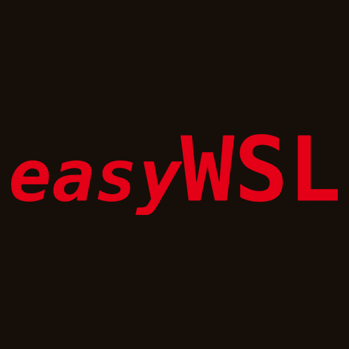

<h1 align="center"> easyWSL</h1>  

  

  Create WSL distros based on Docker Images.

> Made with ❤ by @redcode-labs team.

## What does this project do?

easyWSL makes it way easier to use the wonders of WSL functionality on Windows 10 and 11 systems. Thanks to our efforts, easyWSL grants you an access to use most (almost all) system images from Docker Hub as WSL distros. Our C# sorcery allows us to use Docker Hub API in order to get .tar or .tar.gz images from there. After getting an image, single or multi-layered, we turn it into single image (multi-layered Docker image case) which we easily import as WSL distro.

https://user-images.githubusercontent.com/40501814/161391038-10bf9360-429d-4a47-887f-63b35fae90cd.mp4

## Features

In our latest release, we've added even more features than ever before. All of them wrapped around GUI app using a beauty of WinUI framework.

We've managed to add management features to WSL. With a single click, you can unregister, open .vhdx location as well as see the filesystem of the given distro.

https://user-images.githubusercontent.com/40501814/161391082-101aeaa4-48e1-4cc6-bac3-9bc251efe469.mp4

While this sounds so good so far, we've also made a separate 'Settings' page, to manage your WSL in general. There you can easily adjust things like memory, the number of cores or the swap size assigned with WSL VM. You can also point to different swap file, custom Linux kernel and provide it with custom command line arguments. The given page has also a number of switches, with which you can manage things like localhost forwarding, page reporing, GUI applications (WSLg) support, debug console, nested virtualization. Don't worry if you get lost - you can always just 'Revert to defaults'.

We've added a functionality to register currently or previously used WSL distros using their .vhdx file. Going further down the rabbit hole, we've turned it into more advanced feature - easyWSL can now make snapshots, which can easily be used as a backups/restore points for your distros.

https://user-images.githubusercontent.com/40501814/161391108-42a4e891-99da-4d36-a49d-3960dff28410.mp4

We've added several experimental features as well. One of them, is creating a new user at the time of installing a distro. You now can set the username and password, and, if you want to, use experimental integration of [WSL-Hello-sudo](https://github.com/nullpo-head/WSL-Hello-sudo).

Furthermore, you can use an experimental feature to install development environments during the install process. This includes environments such as Python, Node.js, C/C++ and more. Not to mention, that it works cross-distro and more can be added along the way.

https://user-images.githubusercontent.com/40501814/161391121-e76dc012-b819-434b-acb2-0d2696862911.mp4

## How to get it?

Just go to our Microsoft Store page, which you can find [here](https://www.microsoft.com/store/apps/9NHBTMKS47RB).
Get it, install, and voilà!

## Building on your own

### Prerequisites

* Windows 10 1607 or later (for WSL1) or Windows 10 1903 (18362) or later
   * Note: you might want to check instructions on how to enable WSL [here](https://docs.microsoft.com/en-us/windows/wsl/install-manual)
* [Developer Mode enabled](https://docs.microsoft.com/windows/uwp/get-started/enable-your-device-for-development)
* [Visual Studio 2022](https://visualstudio.microsoft.com/downloads/) (recommended by Microsoft)
* The following workloads:
   * .NET Desktop Development
* Individual components:
   * Windows 10 SDK (10.0.19041.0)
* The following extensions:
   * [System.Text.Json](https://www.nuget.org/packages/System.Text.Json/5.0.2?_src=template)

 More detailed info, including building on older releases of Visual Studio, can be found 
 [here](https://docs.microsoft.com/en-us/windows/apps/windows-app-sdk/set-up-your-development-environment?tabs=vs-2022-17-1-a%2Cvs-2022-17-1-b)

(Upon opening the repo in Visual Studio, it will prompt you to install any missing workloads and features.)

### Building

We currently only build using the solution; command line methods of building a VS solution should work as well.

## Future plans

### CLI

We are looking forward to make a CLI compatible with all of our latest features, in order to make our tool usable in scripts.

If you're looking into using easyWSL as a CLI, the only current option is to use the older version (easyWSL 1.2), which you can get from the release page [here](https://github.com/redcode-labs/easyWSL/releases/tag/1.2).
